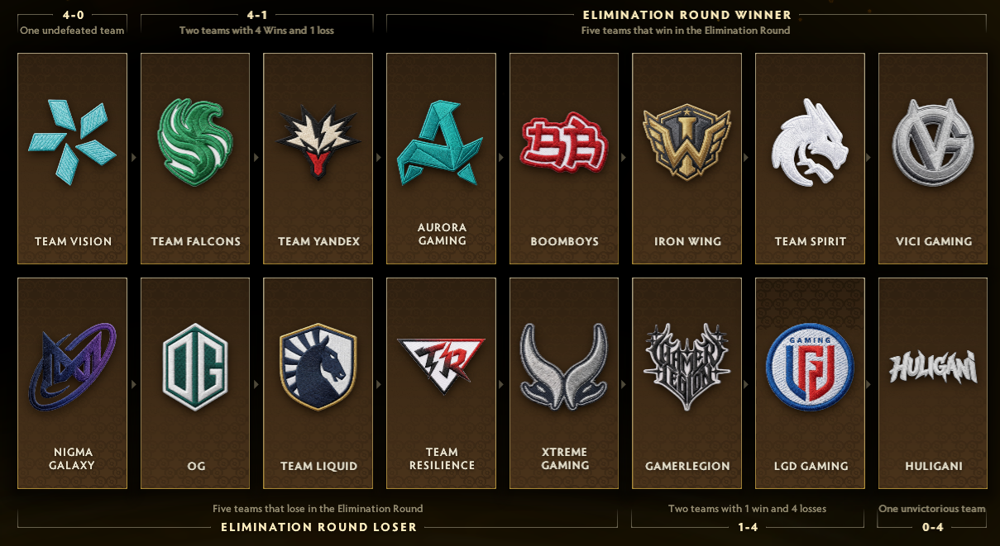

# TI15 Swiss Stage Simulator

A C# console app that predicts [The International 2026 (TI15)](https://www.dota2.com/international) Swiss stage results, based on custom team power ratings.



## Overview

TI15 uses a Swiss-system group stage: 16 teams are split into two hidden groups, and teams are paired against opponents with similar records each round rather than a fixed bracket. A team **qualifies** for the playoffs once it reaches 4 wins, and is **eliminated** once it reaches 4 losses.

This simulator models that entire process — from the real Round 1 schedule through the final elimination-round deciders — and predicts the outcome based on ratings you assign to each team.

## How the simulation works

1. **Round 1** uses the officially published fixed schedule (not randomly generated), since Round 1 pairings were announced ahead of the event.
2. **Rounds 2–3** stay locked within each team's own hidden group (Group A / Group B), matching teams against others with the same current record. This mirrors the real TI15 format, where the marquee cross-group matchups are saved for later rounds.
3. **Rounds 4–5** open up to the full 16-team field, still pairing teams by matching record and avoiding rematches where possible.
4. After 5 rounds, some teams will be stuck at 3-2 or 2-3 without having hit 4 wins or 4 losses. These play a final **elimination round**: each 3-2 team is cross-paired against a 2-3 team. The winner qualifies for the playoffs, the loser is eliminated. This produces the real split of **8 teams qualifying, 8 eliminated**.
5. Every individual match is decided by comparing team ratings — the higher-rated team always wins. If two teams share the exact same rating, the result is a coin flip.

## Requirements

- [.NET 8 SDK](https://dotnet.microsoft.com/download) or later

## Running it

```bash
git clone https://github.com/YOUR_USERNAME/TI15SwissSimulator.git
cd TI15SwissSimulator
dotnet run
```

The console will print every match result round-by-round, a standings table after each round, the elimination-round deciders, and a final summary of which teams qualified and which were eliminated.

## Customizing team ratings

Team ratings live in `InitializeTeams()` inside `Program.cs`:

```csharp
new Team { Name = "Parivision", Group = "A", Rating = 16 },
```

Edit the `Rating` value for any team to reflect your own power rankings, then re-run `dotnet run`. Higher rating = stronger team = more likely (or guaranteed, if strictly higher) to win.

## My predicted results

*(Fill this in with your own simulation output once you've run it — for example:)*

| Status | Teams |
|---|---|
| **Qualified** | Parivision, Team Yandex, Aurora Gaming, Team Spirit, ... |
| **Eliminated** | LGD Gaming, Huligani, Team Resilience, ... |

## Disclaimer

This is a fan-made prediction tool based on a leaked/rumored group draw and self-assigned team ratings. It is not affiliated with Valve or PGL, and predictions are only as good as the ratings you put in.
